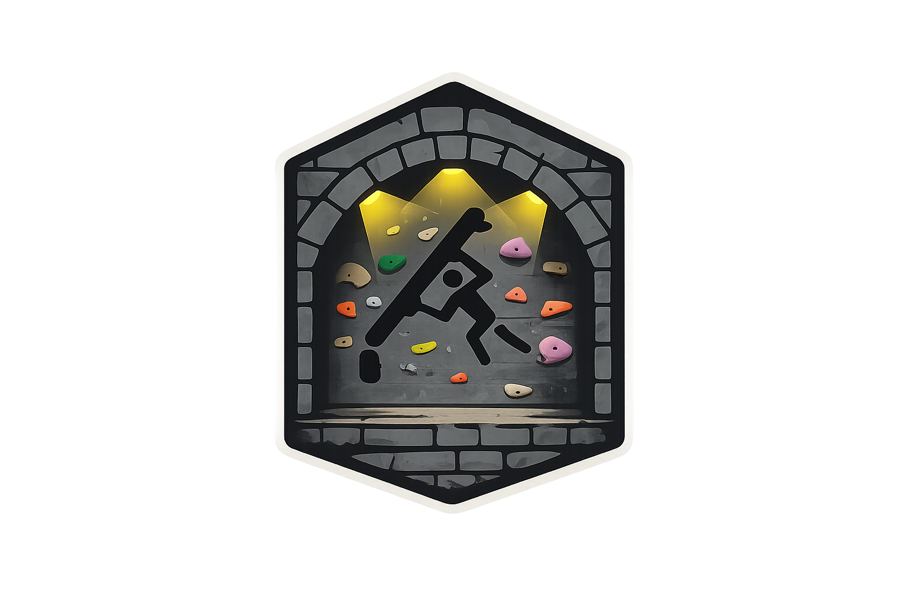

# The Spraywall Cellar 

_Set boulders. Chalk the fuck up. Send it._

A simple web app for my DIY home climbing spraywall. Fully vibecoded.

---

🧠 **Set boulder problems** by selecting a hold type and clicking on the spraywall image to mark the holds. Figure out the grade, give it a shiny name, use tags to describe the moves, and rate it with 1-3 stars to your liking.

🧗‍♂️ **Enter the send mode** to browse through the boulders, sorted by stars or grade based on how weak you are. Grab your stinky shoes, **chalk the fuck up and send hard**! 💪💪

🔐 **Log in with your Google account** to edit/delete boulders — if you're a friend close enough to know the password, that is :)

---

Built with TypeScript, Vite, Tailwind CSS, Panzoom, Firebase... and Claude!

Deployed and running at https://hofiisek.github.io/spraywall-cellar/ via GitHub Pages.
